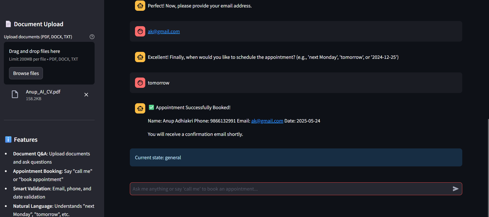
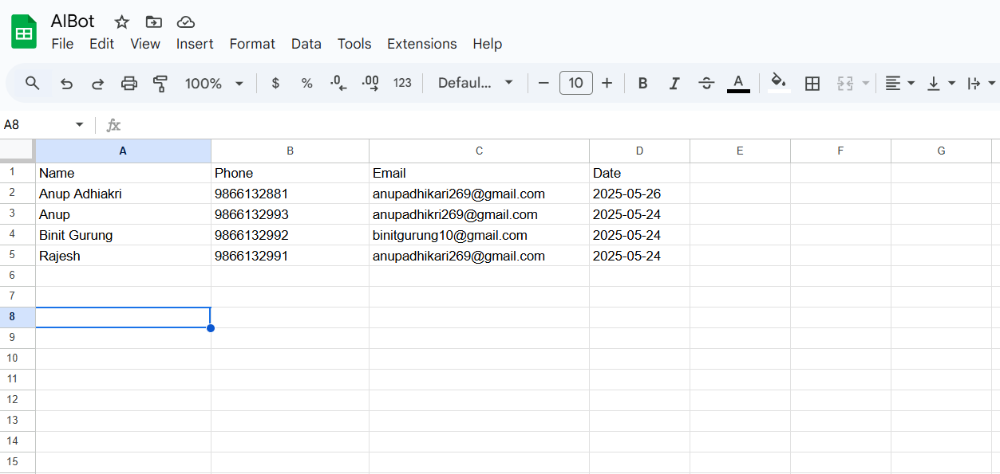
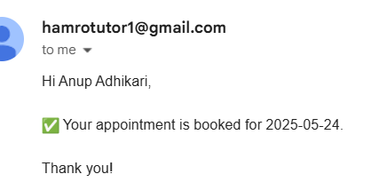

# AI Chatbot Assistant

A comprehensive AI chatbot built with Streamlit and LangChain that can:

- Answer questions from uploaded documents (PDF, DOCX, TXT)
- Book appointments by collecting user information
- Validate user inputs (email, phone, dates)
- Send confirmation emails
- Store appointment data in Google Sheets

## Features

### Document Q&A
- Upload multiple documents in PDF, DOCX, or TXT format
- Ask questions about the content using natural language
- Powered by Google's Gemini AI and FAISS vector store

### Appointment Booking
- Natural language appointment booking ("call me", "book appointment")
- Smart information collection with validation
- Email and phone number validation
- Date parsing from natural language ("next Monday", "tomorrow", etc.)
- Automatic confirmation emails
- Google Sheets integration for data storage




### Smart Validation
- Email format validation
- Nepali mobile number validation (+977, 98XXXXXXXX formats)
- Natural language date parsing
- Input sanitization and error handling

## Setup

1. **Clone the repository**
   ```bash
   git clone https://github.com/Axkratos/ChatBot.git
   cd ChatBot
   ```

2. **Install dependencies**
   ```bash
   pip install -r requirements.txt
   ```

3. **Environment Setup**
   - Copy `.env.example` to `.env`
   - Fill in your API keys and configuration:
     - `GOOGLE_API_KEY`: Your Google AI API key
     - `GOOGLE_CREDENTIALS_BASE64`: base64 format of Service account credentials for Google Sheets
     - `GOOGLE_SHEET_NAME`: Name of your Google Sheet
     - `SMTP_*`: Email configuration for sending confirmations

4. **Google Sheets Setup**
   - Create a Google Sheet with columns: Name, Phone, Email, Appointment Date
   - Create a service account and download credentials
   - Share the sheet with the service account email


5. **Run the application**
   ```bash
   streamlit run main.py
   ```



### Mail
   

## Project Structure

```
ChatBot/
├── .env                      # Environment variables
├── requirements.txt          # Python dependencies
├── README.md                # This file
├── main.py                  # Application entry point
├── config/
│   └── settings.py          # Configuration management
├── utils/
│   ├── validators.py        # Input validation utilities
│   ├── sheets.py           # Google Sheets integration
│   ├── emailer.py          # Email sending functionality
│   └── document_processor.py # Document processing and vectorization
├── tools/
│   ├── booking.py          # Appointment booking tool
│   └── user_input.py       # User input validation tool
├── agents/
│   └── chatbot_agent.py    # Main chatbot agent logic
└── ui/
    └── streamlit_app.py    # Streamlit UI components
```

## Usage

1. **Document Upload**: Use the sidebar to upload documents for Q&A
2. **Ask Questions**: Type questions about uploaded documents
3. **Book Appointments**: Say "call me" or "book appointment" to start the booking process
4. **Natural Dates**: Use phrases like "next Monday", "tomorrow", "26th May" for dates

## API Keys Required

- **Google AI API**: For Gemini AI model and embeddings
- **Google Service Account**: For Sheets access
- **SMTP Credentials**: For sending confirmation emails

## License

MIT License
